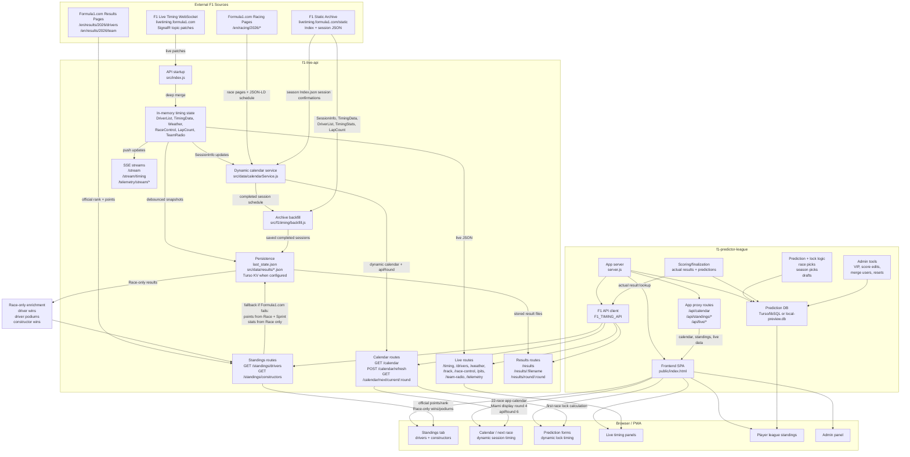

# API + App Ecosystem Flow

This diagram shows how the F1 Live API and F1 Predictor League app work together after the dynamic calendar and standings fixes.

## Key Fixes Captured

- The API calendar is dynamic and sourced from F1 sources instead of hardcoded runtime schedule data.
- The app consumes the API calendar as source of truth and preserves `round` versus `apiRound`.
- Miami can display as round 4 while still using timing archive round 6 for result files.
- F1 standings rank and points are fetched from Formula1.com.
- Driver wins, driver podiums, and constructor wins are enriched from Race sessions only, so Sprint results do not inflate those stats.
